# Entity Rendering Analysis Report
**Date:** December 2024  
**Author:** GitHub Copilot  
**Purpose:** Complete architectural analysis of entity rendering pipeline

## Executive Summary

This report provides a comprehensive analysis of how entities are rendered to the screen in the softwareEngineering_teamDelta application. The system employs a sophisticated multi-layered rendering architecture with controller-based entity management, performance optimization through frustum culling, and advanced visual effects.

---

## 1. Rendering Architecture Overview

The entity rendering system is built on a **layered architecture** with clear separation of concerns:

---

## 2. Entity Class Architecture

The `Entity` class serves as the foundation with a **controller-based architecture**:

---

## 3. Rendering Pipeline Flow

The complete rendering pipeline follows this detailed flow:

---

## 4. Render Groups and Entity Classification

The EntityLayerRenderer organizes entities into rendering groups for optimal performance:

---

## 5. Visual Effects and Highlighting System

The RenderController provides sophisticated visual feedback:

```mermaid
flowchart TD
    A[RenderController Visual Effects] --> B[Highlight Types]
    A --> C[State Indicators]
    A --> D[Visual Effects]
    
    B --> B1[SELECTED - Green Outline]
    B --> B2[HOVER - White Outline]
    B --> B3[BOX_HOVERED - Green Transparent]
    B --> B4[COMBAT - Red Pulse Effect]
    B --> B5[RESOURCE - Orange Bob Effect]
    
    C --> C1[MOVING - Green Arrow ➜]
    C --> C2[GATHERING - Orange Pickaxe ⛏]
    C --> C3[BUILDING - Brown Hammer 🔨]
    C --> C4[ATTACKING - Red Sword ⚔]
    C --> C5[FOLLOWING - Blue Group 👥]
    C --> C6[FLEEING - Yellow Wind 💨]
    C --> C7[IDLE - Gray Sleep 💤]
    
    D --> D1[DAMAGE_NUMBER - Floating Text]
    D --> D2[FLOATING_TEXT - Info Text]
    D --> D3[PARTICLE - Visual Particles]
    
    E[Highlight Rendering Styles] --> E1[Outline - Rectangle Border]
    E --> E2[Pulse - Animated Opacity]
    E --> E3[Bob - Vertical Movement]
    
    style A fill:#e1f5fe
    style B fill:#e8f5e8
    style C fill:#fff3e0
    style D fill:#f3e5f5
    style E fill:#ffebee
```

---

## 6. Performance Optimization Features

The system includes several performance optimization mechanisms:

---

## 7. Entity Position and Size Access

The system uses standardized accessors for entity properties:

---

## 8. Integration with Game Systems

The rendering system integrates with multiple game systems:

---

## 9. Key Technical Insights

### 9.1 Controller-Based Architecture
- **Delegation Pattern**: Entity.render() delegates to RenderController when available
- **Fallback Mechanism**: Falls back to _fallbackRender() for compatibility
- **Separation of Concerns**: Rendering logic separated from entity logic

### 9.2 Multi-Layer Rendering
- **Layer Hierarchy**: TERRAIN → ENTITIES → EFFECTS → UI_GAME → UI_DEBUG → UI_MENU
- **State-Aware**: Different layers rendered based on game state
- **Performance Tracking**: Per-layer render time measurement

### 9.3 Visual Effects System
- **Highlight States**: Multiple highlight types with different visual styles
- **State Indicators**: Visual symbols showing entity states above entities
- **Animation Support**: Bob, pulse, and other animated effects

### 9.4 Performance Optimization
- **Frustum Culling**: Only render entities within viewport bounds
- **Depth Sorting**: Y-position based sorting for proper draw order
- **Batching Ready**: Architecture supports future sprite batching optimization

---

## 10. File Dependencies and Key Components

### Core Rendering Files:
- `Classes/containers/Entity.js` - Base entity class with controller delegation
- `Classes/controllers/RenderController.js` - Advanced rendering and visual effects
- `Classes/rendering/EntityLayerRenderer.js` - Entity collection and group rendering
- `Classes/rendering/RenderLayerManager.js` - Multi-layer rendering coordination
- `Classes/rendering/Sprite2D.js` - Basic sprite/image rendering

### Integration Points:
- `sketch.js` - Main render loop calling RenderLayerManager
- Global arrays: `ants[]`, `g_resourceList` - Entity data sources
- Performance monitoring integration
- UI system coordination for gamestate-aware rendering

---

## 11. Recommendations for Future Development

1. **Sprite Batching**: Implement true sprite batching for large entity counts
2. **WebGL Optimization**: Consider WebGL renderer for better performance
3. **Animation System**: Expand animation support beyond basic bob/pulse effects  
4. **LOD System**: Level-of-detail rendering for distant entities
5. **Debug Visualization**: Enhanced debug rendering for development

---

This analysis reveals a well-architected, performance-conscious rendering system with clear separation of concerns and room for future optimization. The controller-based approach provides flexibility while maintaining consistent visual presentation across all entity types.