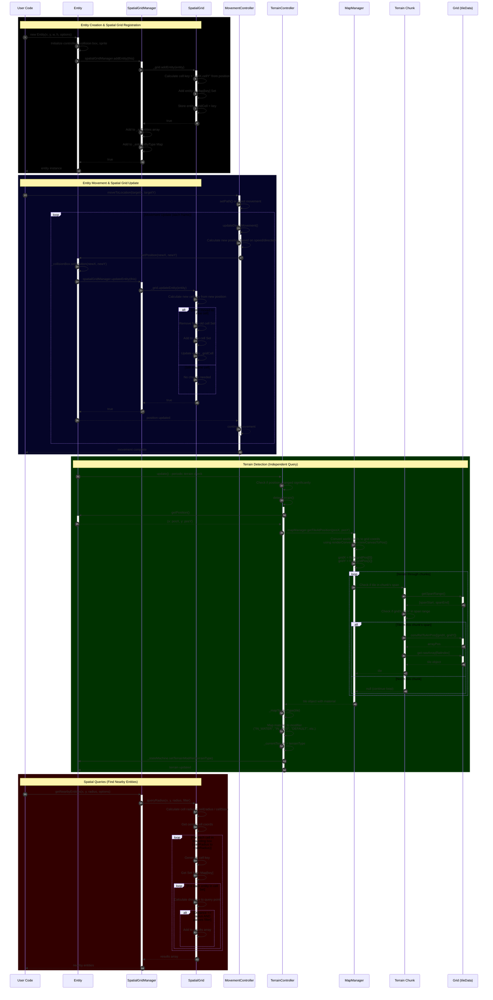

```mermaid
sequenceDiagram
    autonumber
    participant User as User Code
    participant Entity
    participant SGM as SpatialGridManager
    participant SG as SpatialGrid
    participant MC as MovementController
    participant TC as TerrainController
    participant MM as MapManager
    participant Chunk as Terrain Chunk
    participant Grid as Grid (tileData)
    
    rect rgb(0, 0, 0)
    Note over User,SG: Entity Creation & Spatial Grid Registration
    User->>+Entity: new Entity(x, y, w, h, options)
    Entity->>Entity: Initialize controllers, collision box, sprite
    Entity->>+SGM: spatialGridManager.addEntity(this)
    SGM->>+SG: _grid.addEntity(entity)
    SG->>SG: Calculate cell key = "cellX,cellY" from position
    SG->>SG: Add entity to Map[key] Set
    SG->>SG: Store entity._gridCell = key
    SG-->>-SGM: true
    SGM->>SGM: Add to _allEntities array
    SGM->>SGM: Add to _entitiesByType Map
    SGM-->>-Entity: true
    Entity-->>-User: entity instance
    end
    
    rect rgb(5, 5, 40)
    Note over User,SG: Entity Movement & Spatial Grid Update
    User->>+MC: moveToLocation(targetX, targetY)
    MC->>MC: setPath() or direct movement
    loop Movement Update (each frame)
        MC->>+MC: updateDirectMovement()
        MC->>MC: Calculate new position based on speed/direction
        MC->>+Entity: setPosition(newX, newY)
        Entity->>Entity: _collisionBox.setPosition(newX, newY)
        Entity->>+SGM: spatialGridManager.updateEntity(this)
        SGM->>+SG: _grid.updateEntity(entity)
        SG->>SG: Calculate new cell key from new position
        alt Entity moved to new cell
            SG->>SG: Remove from old cell Set
            SG->>SG: Add to new cell Set
            SG->>SG: Update entity._gridCell
        else Still in same cell
            SG->>SG: No change needed
        end
        SG-->>-SGM: true
        SGM-->>-Entity: true
        Entity-->>-MC: position updated
        MC-->>-MC: continue movement
    end
    MC-->>-User: movement complete
    end
    
    rect rgb(0, 50, 0)
    Note over Entity,Grid: Terrain Detection (Independent Query)
    Entity->>+TC: update() - periodic terrain check
    TC->>TC: Check if position changed significantly
    TC->>+TC: detectTerrain()
    TC->>+Entity: getPosition()
    Entity-->>-TC: {x: posX, y: posY}
    TC->>+MM: mapManager.getTileAtPosition(posX, posY)
    MM->>MM: Convert world pixels to grid coords<br/>using renderConversion.convCanvasToPos()
    MM->>MM: gridX = floor(gridPos[0])<br/>gridY = floor(gridPos[1])
    
    loop Iterate through chunks
        MM->>+Chunk: Check if tile in chunk's span
        Chunk->>+Grid: getSpanRange()
        Grid-->>-Chunk: [spanStart, spanEnd]
        Chunk->>Chunk: Check if gridX/gridY in span range
        alt Tile in this chunk's span
            Chunk->>+Grid: convRelToArrPos([gridX, gridY])
            Grid-->>-Chunk: arrayPos
            Chunk->>+Grid: get rawArray[flatIndex]
            Grid-->>-Chunk: tile object
            Chunk-->>MM: tile
        else Not in this chunk
            Chunk-->>-MM: null (continue loop)
        end
    end
    
    MM-->>-TC: tile object with material
    TC->>TC: _mapTerrainType(tile)
    TC->>TC: Map material to modifier<br/>("IN_WATER", "IN_MUD", "DEFAULT", etc.)
    TC->>TC: _currentTerrain = terrainType
    TC->>Entity: _stateMachine.setTerrainModifier(terrainType)
    TC-->>-Entity: terrain updated
    end
    
    rect rgb(50, 0, 0)
    Note over User,SG: Spatial Queries (Find Nearby Entities)
    User->>+SGM: getNearbyEntities(x, y, radius, options)
    SGM->>+SG: queryRadius(x, y, radius, filter)
    SG->>SG: Calculate cell radius = ceil(radius / cellSize)
    SG->>SG: Get center cell coords
    
    loop For each cell in bounding box (-cellRadius to +cellRadius)
        SG->>SG: Generate cell key
        SG->>SG: Get Set from Map[key]
        loop For each entity in cell Set
            SG->>SG: Calculate distance to query point
            alt Distance <= radius AND passes filter
                SG->>SG: Add to results array
            end
        end
    end
    
    SG-->>-SGM: results array
    SGM-->>-User: nearby entities
    end
```